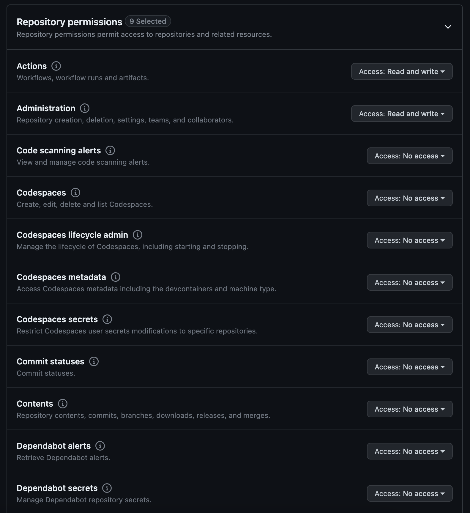

# Taking Python to Production - Python Package Template

1. created folder
1. `git init; git branch -M main`
1. `mkdir '{{cookiecutter.repo_name}}'`
1. `cp -R ../packaging/* ../packaging/.* '{{cookiecutter.repo_name}}'`
1. deleted the venvs since they're bad when moved
1. remove the .git folder inside of cookiecutter.repo_name
1. `cd '{{cookiecutter.repo_name}}'; ./run.sh clean`
1. got this error `A valid repository for "/home/eric/repos/python-course-cookiecutter-v1" could not be found in the following locations:`. The reason is a `cookiecutter.json` file must exist at the repo root.
1. made the decision to create a `src/` folder
1. the `.github/workflows.publish.yml` has issues with jinja because of the `${{ secrets... }}` syntax. It needs to be escaped with `` and ``.
  - adding the `--verbose` flag to `cookiecutter` prints out each file so you can tell exactly the file it fails on
1. `.vscode/settings.json` seems to not be very filled out, we should find that from previous videos

Had to add this in order to pass the build for this repo
```yaml
- name: Configure git user
  run: |
    git config --global user.email "test@test.com"
    git config --global user.name "Eric Riddoch"
```

- GitHub Token
  
  
  
  

